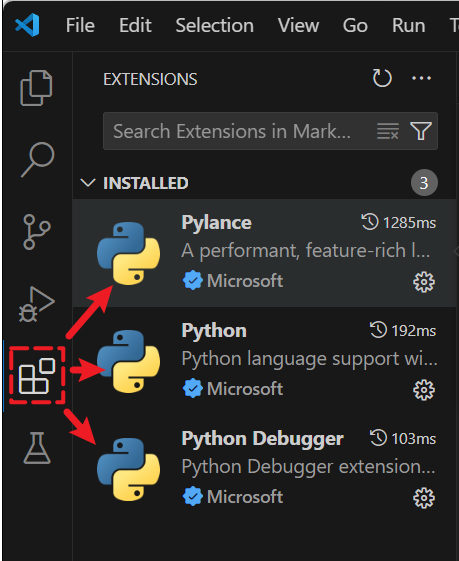
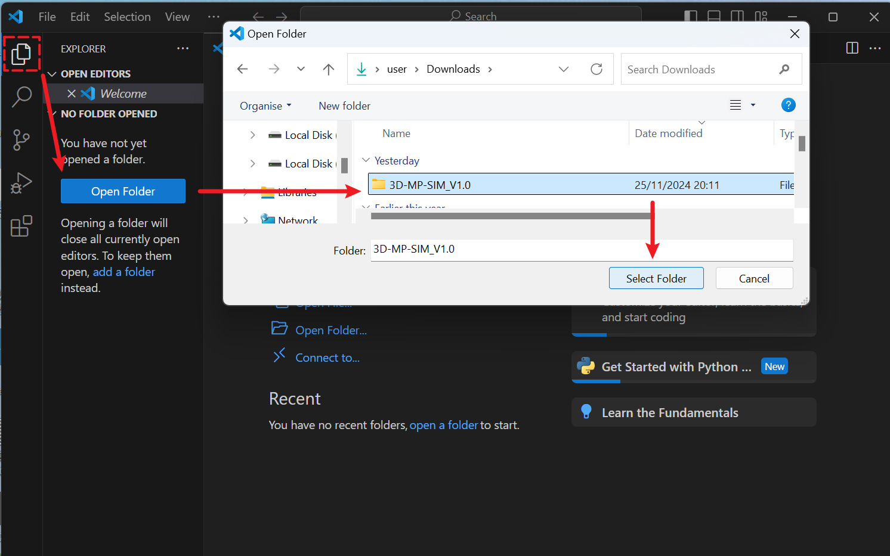
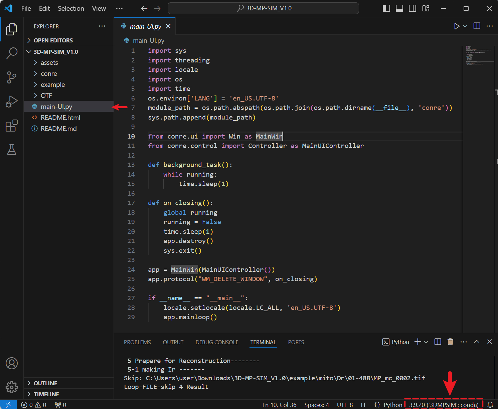
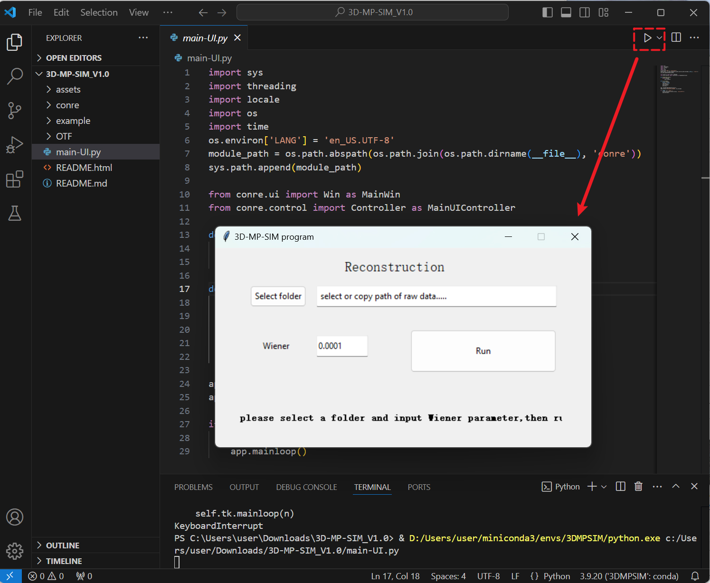
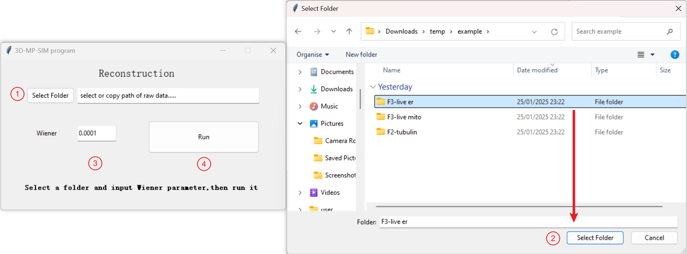
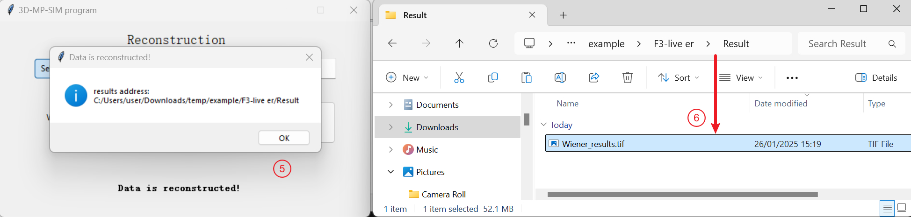

<!-- [](https://doi.org/10.1038/s41587-021-01092-2)
[](https://github.com/WeisongZhao/sparse-deconv-py/)
[](https://github.com/WeisongZhao/sparse-deconv-py/blob/master/LICENSE/)<br>
[](https://twitter.com/hashtag/sparsedeconvolution?src=hashtag_click)
[](https://github.com/WeisongZhao/sparse-deconv-py/) 
[](https://github.com/WeisongZhao/sparse-deconv-py/) 
[](https://github.com/WeisongZhao/sparse-deconv-py/) -->


<p>
<h2 align="center">3D 
multiplane SIM (3D-MP-SIM)<sub> Python v1.0</sub></h2>
<!-- <h6 align="center"><sup>v1.0.3</sup></h6> -->
<!-- <h4 align="center">This repository contains the updating version of Sparse deconvolution.</h4> -->
</p>  


<!-- **3D-MP-SIM**  which simultaneously detects multiplane images and reconstructs them with synergistically evolved algorithms based on a new physical model,which  algorithm can be constructed as follows -->

<!-- We haven’t tested it thoroughly, and the development is work in progress, so expect rough edges. As a result, feedback, questions, bug reports, and patches are welcome and encouraged!

It is a part of publication. For details, please refer to: "[Weisong Zhao et al. Sparse deconvolution improves the resolution of live-cell super-resolution fluorescence microscopy, Nature Biotechnology (2021)](https://doi.org/10.1038/s41587-021-01092-2)". -->


## Recommended Hardware
- **OS**: Windows 11 or Windows 10
- **CPU**: Intel(R) Core(TM) i5-10400 CPU @ 2.90GHz 
- **RAM**: 64GB DDR4 (2666MHz)
- **GPU**: NVIDIA GeForce RTX 4060 Ti (16 GB)
- **Storage**: 512GB 

  or

- **OS**: MacOS 12.6.7
- **CPU**: Intel Core i7
- **RAM**: 16GB
- **GPU**: Intel Iris Plus Graphics 655 1536MB
- **Storage**: 500GB 

## Environment Requirements


- **Python**: 3.9.20
- **numpy**: 1.26.4
- **torch**:  2.5.1
- **tifffile**: 2023.7.18 
- **opencv-python**: 4.8.0.74
- **EMD-signal**: 1.4.0 
- **scikit-image**: 0.22.0
- **pyotf**: 0.0.3 
<!-- - **pocpy**: 0.2.0      -->
<!-- - **fft-conv-pytorch**: 1.1.3 or later   -->
- **Tools**:
  - **Anaconda** (https://www.anaconda.com/download/success)
  - **Visual Studio Code** (https://code.visualstudio.com/)


## Installation
- **step 1**:  Install Anaconda on your computer

After installing Anaconda on your computer, Windows users should open **Anaconda Powershell Prompt**, while Mac users should open **Terminal**. Then, enter the following commands (*make sure to type 'y' to confirm when prompted*)

- **step 2**:  Install a Python environment using Anaconda
```
conda create -n 3DMPSIM python==3.9.20
```

Activate this environment
```
conda activate 3DMPSIM
```

- **step 3**: Install the CPU version of PyTorch using the following command
```
conda install pytorch torchvision torchaudio cpuonly -c pytorch
```
<!-- 
Alternatively, if your computer has a GPU (16GB or more memory) and CUDA installed, you can try installing the GPU version of PyTorch for better performance (make sure to match the appropriate CUDA version).
For example, if your CUDA version is 11.8, use the following command(For other versions, please refer to [the official website](https://pytorch.org/get-started/locally/))
```
conda install pytorch torchvision torchaudio pytorch-cuda=11.8 -c pytorch -c nvidia
``` -->


<!-- [^1]: If the GPU memory is less than 16GB, it may lead to insufficient memory issues. It is recommended to install the CPU version of PyTorch and run the program. -->
<!-- [^2]: If your CUDA version is lower, you can try downloading the corresponding .whl files for torch and torchvision directly from this [website](https://download.pytorch.org/whl/torch_stable.html). Then, install them locally using: pip install xxx.whl -->

- **step 4**: Use `pip` to install the following packages(Run each line separately):

`pip install numpy==1.26.4`

`pip install tifffile==2023.7.18`

`pip install opencv-python`

`pip install EMD-signal==1.4.0`  

`pip install scikit-image==0.22.0`

<!-- ```pip install fft-conv-pytorch``` -->
<!-- ```pip install pocpy=0.2.0``` -->
`pip install pyotf==0.0.3`


The environment configuration is complete, close the command line  window.

## Visual Studio Code setting

- **step 1**: Install Visual Studio Code on your computer
<!-- <br> -->
- **step 2**: Install three extensions
 The user needs to install three extensions from the sidebar: **Pylance, Python, Python Debugger**

<div align="center">
  
</div>

## Run program
Please download the code and the registered eight-plane raw data. Then open the code folder **(3D-MP-SIM_V1.0)**. 

<div align="center">
  
</div>

Click the main function (**main-UI\.py**) and then select the previously configured Python environment (**'3DMPSIM'**) in the bottom right corner.

<!-- And select the previously configured Python environment ('3DMPSIM') in the bottom right corner. -->

<div align="center">
  
</div>


Run the "**main-UI\.py**",and will launch the main interface.

<div align="center">
  
</div>

<!--#{ width=45%, style="display:block; margin:0 auto;"}
 -->

<br>

## Rconstration data

Follow the steps below thereafter:
1. Click the '**Select Folder**' button. 
2. Select the **raw data** folder (e.g., '**\example\\F3-live er**', NOTE:**Do not enter subfolders.**). 
3. Input the Wiener parameter (The default value for Wiener parameter is set to 0.0001 in the example data.).
4. Click the '**Run**' button and wait for the program to complete its execution. 
(Approximately 10 minutes on CPU, and the main interface becomes unresponsive) 
5. When the program finishes, a message box will prompt you with the location of the result files. 
6. '**Wiener_results.tif**' is the reconstructed image.

<!-- -->


<div align="center">
  
</div>

<div align="center">
  
</div>


<!-- - NOTE: The GPU acceleration feature using CuPy requires a CUDA-based NVIDIA GPU. It could provide a ~30 times faster reconstruction speed for a `512 × 512 × 5` image stack.
- Clone/download, and run the `demo.py`

```python
from sparse_recon.sparse_deconv import sparse_deconv

im = io.imread('test.tif')
plt.imshow(im,cmap = 'gray')
plt.show()

pixelsize = 65 #(nm)
resolution = 280 #(nm)

img_recon = sparse_deconv(im, resolution / pixelsize)
plt.imshow(img_recon / img_recon.max() * 255,cmap = 'gray')
plt.show()
```

## Tested dependency 

- Python 3.7
- NumPy 1.21.4
- CuPy 9.6.0 (CUDA 11.5)
- PyWavelets 1.1.1

## Version

- v0.3.0 full Sparse deconvolution features
- v0.2.0 iterative deconvolution
- v0.1.0 initialized and started from [dzh929](https://github.com/dzh929/Sparse-SIM-python)

## Related links: 
- MATLAB version of Sparse deconvolution: [MATLAB version](https://github.com/WeisongZhao/Sparse-SIM)
- A light weight MATLAB library for making exsiting images to videos: [img2vid](https://github.com/WeisongZhao/img2vid)
- An adaptive filter to remove isolate hot pixels: [Adaptive filter imagej-plugin](https://github.com/WeisongZhao/AdaptiveMedian.imagej)
- A tool for multi-color 2D or 3D imaging: [Merge channels](https://github.com/WeisongZhao/Palette.ui)
- **Further reading:** [#behind_the_paper](https://bioengineeringcommunity.nature.com/posts/physical-resolution-might-be-meaningless-if-in-the-mathmetical-space) & [blog](https://weisongzhao.github.io/rl_positivity_sim)
- **Some fancy results and comparisons:** [my website](https://weisongzhao.github.io/home/portfolio-4-col.html#Sparse)
- **Preprint:** [Weisong Zhao et al., Extending resolution of structured illumination microscopy with sparse deconvolution, Research Square (2021).](https://doi.org/10.21203/rs.3.rs-279271/v1)
- **Reference:** [Weisong Zhao et al., Sparse deconvolution improves the resolution of live-cell super-resolution fluorescence microscopy, Nature Biotechnology (2021).](https://doi.org/10.1038/s41587-021-01092-2)


## Open source [Sparse deconvolution](https://github.com/WeisongZhao/Sparse-deconv-py)

- This software and corresponding methods can only be used for **non-commercial** use, and they are under Open Data Commons Open Database License v1.0.
- Feedback, questions, bug reports and patches are welcome and encouraged!

 -->

## Contact
For any questions/comments about this code,please contact <a href="mailto:hxs@hsc.pku.edu.cn">hxs@hsc.pku.edu.cn</a>

## Copyright and Software License
Copyright (c) 2025 @ Huang Lab, Peking University, Beijing, China

The package is licensed under the [GNU GPL](https://www.gnu.org/licenses/).
